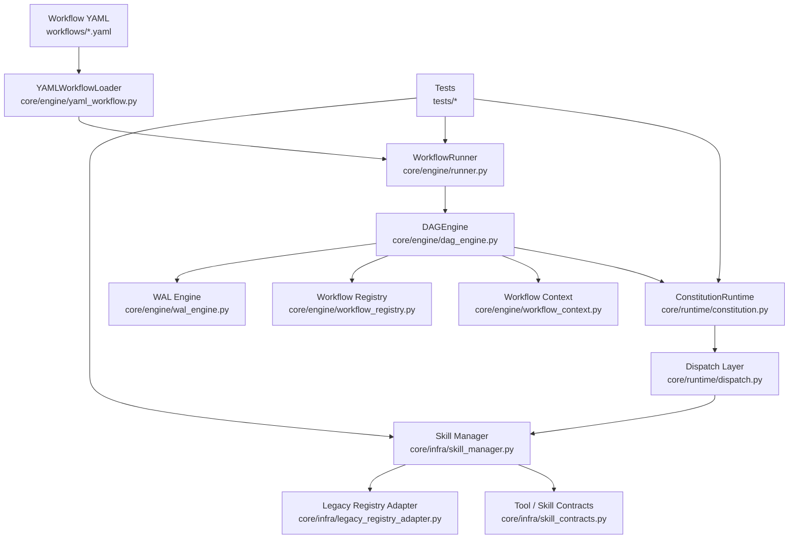

# Architecture Overview

## Layer summary

### 1. Workflow definition layer
- input: YAML workflow files
- responsibility: declare nodes, edges, inputs, outputs, and execution relationships

### 2. Engine layer
- components: loader, runner, DAG engine, registry, context, WAL
- responsibility: parse workflow, execute nodes in dependency order, store run state

### 3. Runtime/governance layer
- components: constitution runtime, dispatch, routing policies
- responsibility: decide how requests are routed and constrained

### 4. Skill/contract layer
- components: skill manager, tool schemas, capability profiles, legacy adapter
- responsibility: normalize tool invocation and enforce execution policy

### 5. Verification layer
- components: tests, boundary checks, CI
- responsibility: validate that the runtime remains consistent and minimally runnable

## Intended evolution

The target architecture is:

- engine code remains independent of host workspace persona/memory files
- workflow execution forms a standalone closure
- CI verifies not only unit tests but also one real smoke workflow
- skill integration becomes cleaner and less dependent on legacy workspace state
